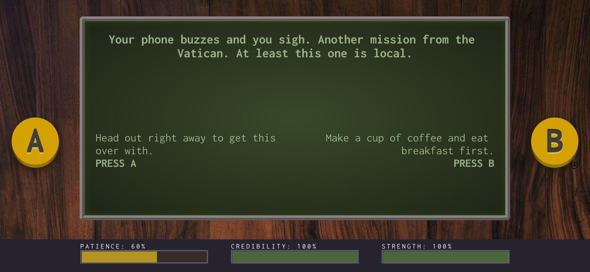

# CHVRCHPOTATO

_This project was bootstrapped with [Create React App](https://github.com/facebook/create-react-app)._

A text-based game about a lazy exorcist.

## Learning goal

A personal project, this is an exercise in creativity and learning. With a very lightweight interface, this game is a good way to learn TypeScript. In it, I've practiced using the React.FC type, and creating interfaces for props.

I'm also enjoying learning how to tell stories in a branching, CYOA format.

## Status

In progress.

**To do:**

- Complete story
- Playtest
- Add title screen

**Nice ot haves / possible to dos:**

- Build tracking/saving for player wins/losses
- Create a db to store the story data?
- Use OAuth to enable user login?

## The story

In his younger days, Father Ignavus was an accomplished exorcist. Now, though, he's in his 50s, grumpy, and tired. Exorcisms are **hard work**. Now, he spends most of his time thinking up plausible explanations for hauntings and possessions so he doesn't have to actually banish any demons. Sometimes his explanations are convincing; sometimes they're not. As Father Ignavus, keep up your credibility so you don't have to spend your strength!

## Setup

To set up locally,

1. Fork and clone the repo
1. Change into the project directory
1. Run `npm install`
1. Run `npm start` to begin the development server

## Gameplay

Designed to play like an old-school handheld console, the game features a large screen to display the text, and two buttons to select between the story options. A bar at the bottom displays the player's stats, which update with each choice the player makes.

## Tech Stack

 
 
 
 
 
<!--  -->
